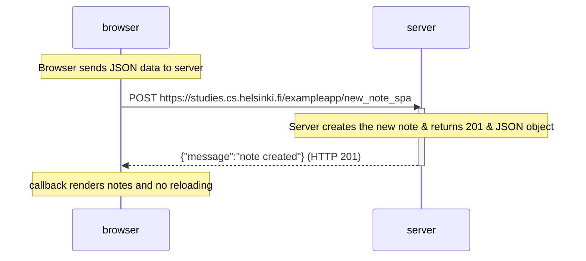

```mermaid
sequenceDiagram
    participant browser
    participant server

    Note over browser: Browser sends JSON data to server 

    browser->>server: POST https://studies.cs.helsinki.fi/exampleapp/new_note_spa
    activate server
    Note over server: Server creates the new note & returns 201 & JSON object
    server-->>browser: {"message":"note created"} (HTTP 201)
    deactivate server

    Note over browser: callback renders notes and no reloading
```
